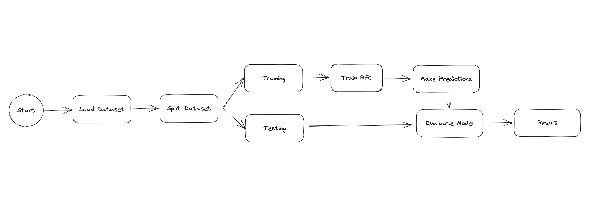

# Iris Classification
This project uses machine learning to classify different species of the Iris flower. It's a great introductory project for those interested in understanding basic principles of machine learning in Python.

# Project Overview
In this project I utilize the Iris flower dataset from scikit-learn's datasets module. The goal of the project is to train a model to distinguish between different species of Iris flowers based on certain features like petal length, petal width, sepal length, and sepal width.

# Technologies Used
- Python 3.9
- Scikit-learn
- Docker

# Getting Started
Here's a step-by-step guide on how to get this project up and running on your local machine for development and testing purposes.

# Prerequisites
Ensure that you have the following installed on your local machine:
Docker

# Installation and Running the Project
Clone the repository to your local machine:

```
git clone https://github.com/knbrlo/iris-classification.git
```

Navigate to your project directory and build the Docker image:
```
cd iris-classification
docker build -t iris-classification .
```

Run the Docker container:

```
docker run iris-classification
```

# Testing
Currently, there are no tests set up for this project. As the project grows, I will add unit tests and instructions on how to run them.

# Details
If you're new to AI or Machine Learning below is a step by step of how this all works including definitions.



## Step 1 - Load Dataset
We first load the Iris dataset which includes measurements of different attributes (features) of Iris flowers and their corresponding species (labels).

## Step 2 - Splitting the Dataset
We split the dataset into two parts, training set and testing set. The training set is used to train our model and the testing set is used to evaluate the model's performance.

## Step 3 - Training the Model
We use the training set to train our Random Forest Classifier. The classifier uses the features and their corresponding labels to learn the underlying patterns in the data.

## Step 4 - Making Predictions
Once the model is trained, we use it to predict the species of Iris flowers in our test set. These predictions can then be compared to the actual species to assess the performance of our classifier.

## Step 5 - Evaluating the Model
The last step is to evaluate how well our model performs. This is done by comparing the predictions made by our model with the actual labels in the test set. The accuracy score is one common metric for classification tasks. It measures the proportion of correct predictions out of all predictions made.

## Definitions

### Classification
Classification is a type of supervised learning where the goal is to predict the categorical class labels of new instances, based on past observations. In your case, the classes are different species of the Iris flower.

### Training 
Training a model means learning (estimating) the best parameters that fit the dataset. This is achieved by minimizing a loss function that measures the difference between the model's predictions and the actual data. In supervised learning, the model is trained using labeled data.

### Testing
Testing is the process where a trained model is used to predict the labels of a separate dataset, the test dataset. The test dataset is separate from the training dataset and is used to assess the performance of the model on unseen data.

### Random Forest
Random Forest is a type of ensemble machine learning algorithm. It creates a set of decision trees from a randomly selected subset of the training set, which then aggregates the votes from different decision trees to decide the final class of the test object.

### Classifiers
A classifier is a machine learning model that is used to distinguish among different classes. In your project, the classifier is trained to distinguish between different species of Iris flowers.

### Predictions
In the context of machine learning, predictions refer to the output of our model when we input some unseen test data. After the model is trained with the training set, it can make predictions on new data points.


# Contributing
I appreciate any contributions you might want to make. Feel free to fork this repository, make your changes, and submit a pull request.

# License
This project is licensed under the MIT License.

# Acknowledgments
The Iris flower dataset is provided by scikit-learn's datasets module.